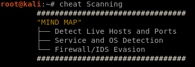

# Penetration Testing Professional Cheat Sheet (PTPCheatsheets)
[Penetration Testing Professional (PTP)](https://www.elearnsecurity.com/course/penetration_testing/) is an online penetration testing course from [eLearnSecurity](https://www.elearnsecurity.com) that teaches all the skills needed to be a professional penetration tester. These cheatsheets are part of my [eCPPTv2-Journey](https://github.com/0xb1tByte/eCPPTv2-Journey), the purpose of these cheatsheets are to aid **PTP Students** in remembering **Commands/some Protocols Details/Exploit Techniques** that are mentioned in the course slides.

# Requirements
The only requirement to use these cheatsheets is [cheat](https://github.com/cheat/cheat) to be installed.

# How to Use
In order to use these cheatsheets, the cheatsheets in this repository need to go into ```~/.cheat/``` directory. For instance after the files are moved into that directory,
```cheat Scanning``` will display the **Scanning module** cheatsheet.

# Screen Shots



